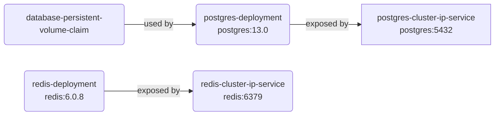

# Multi container application with k8s

## List of elements
* PersistentVolumeClaim type
    * database-persistent-volume-claim
* Deployment
    * postgres-deployment
    * redis-deployment
* Service
    * postgres-cluster-ip-service
    * redis-cluster-ip-service

## Graph of elements

