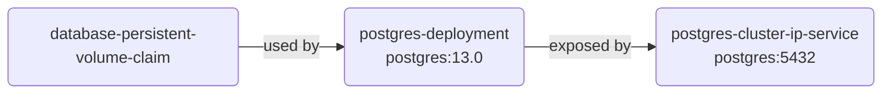
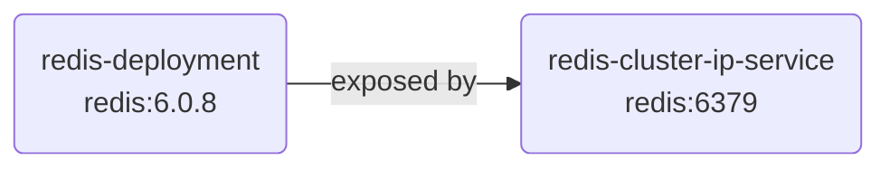
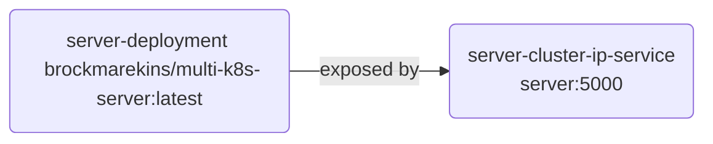
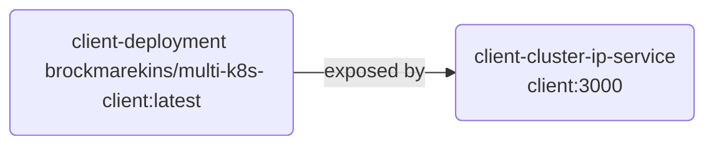
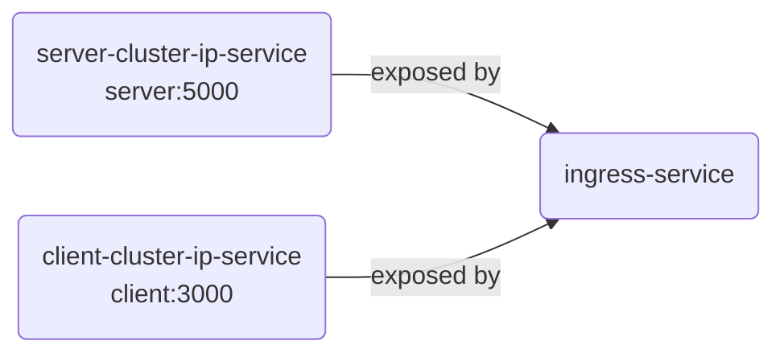
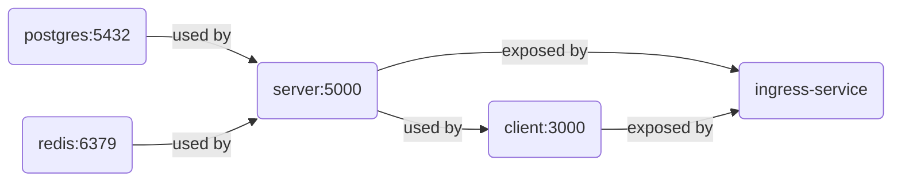

# Multi container application with k8s

## List of elements
* PersistentVolumeClaim
    * database-persistent-volume-claim
* Deployment
    * postgres-deployment
    * redis-deployment
    * server-deployment
    * client-deployment
* Service
    * postgres-cluster-ip-service
    * redis-cluster-ip-service
    * server-cluster-ip-service
    * client-cluster-ip-service
* Ingress
    * ingress-service

## Graphs of dependencies

### postgres dependencies

### redis dependencies

### server dependencies

### client dependencies

### ingress dependencies

### application dependencies

